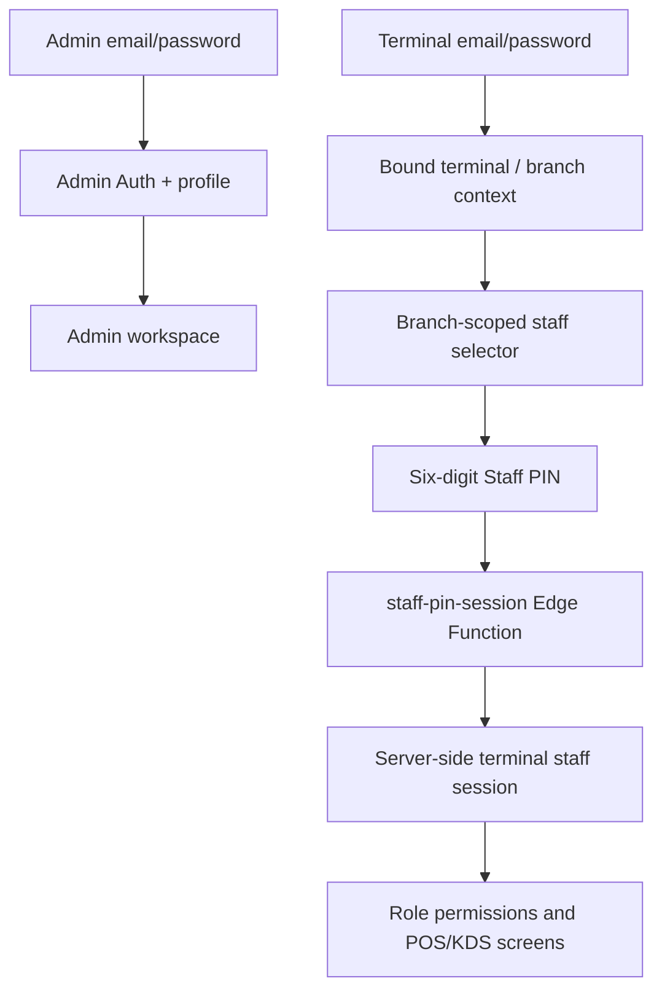

# Authentication and Session Flow

## Implemented model

Admin and terminal devices use separate Supabase Auth email/password identities. Operational staff are `public.staff` records with no email, password, or Supabase Auth session. `profiles` is retained solely as the legacy operational identity key used by historical orders, payments, and audit records.

## Current controls

- Admin sign-in requires an active ADMIN profile. Terminal sign-in requires `pos_terminals.auth_user_id` to be bound to an active, registered terminal.
- `resolve_authenticated_terminal` and `list_authenticated_terminal_staff` derive terminal and branch exclusively from the terminal Auth identity; browser device identifiers are no longer used operationally.
- `staff-pin-session` validates the selected `staff` record's six-digit PIN on the server. It never creates, exchanges, or returns a staff Auth token.
- `terminal_staff_sessions` records the terminal Auth session plus `staff_record_id`, role, permissions, lifecycle, and activity timestamps. Legacy `staff_id` remains for historical foreign-key compatibility.
- Idle lock calls the terminal session lock flow; switching staff ends the operator session before selection resumes.
- Manager approval is action-scoped in order/discount flows and uses server-side PIN verification. It does not intentionally elevate the requester permanently.

## Remaining verification

The terminal Auth, Auth-free staff PIN, server-side staff-session path, and Admin user-management Edge Function are deployed on staging. The Admin function manages `public.staff` records and returns a one-time PIN; it does not create staff email/password credentials. Admin-route negative authorization coverage is still required before a production release decision.
