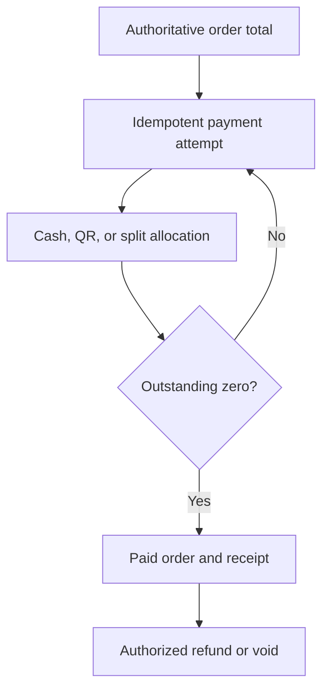

# Payment Flow

Payment acceptance is routed through the payments Edge Function and database RPCs. Cash tender/change, split allocation, receipts, refunds, business numbering, and shift cash movement are represented in migrations. UI state is not authoritative.

Double-payment and lost-response behaviour must be reverified on the current Staging data.
