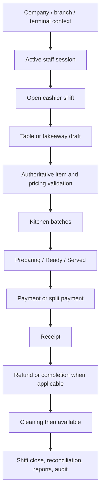

# POS Business Flow

Implemented modules include company/branch configuration, terminal registration and access, staff assignments, categories/products/pricing, tables, drafts, append-only kitchen batches, payment/receipt/refund RPCs, shifts/cash movements, vouchers/promotions, reports, and audit records.

Key server-authoritative paths include `create_pos_draft`, draft-item replacement, `append_pos_order_items`, kitchen transitions, payment acceptance, split payment, refund, table movement, and cashier shift functions. Exact availability depends on permissions, terminal/session state, and database rules.

Tables transition through available, occupied, cleaning, and available states where the corresponding database lifecycle functions are used. Kitchen batches are intended to dispatch additions as new batches rather than re-send prior items.

Offline recovery, multi-terminal conflict behaviour, all provider integrations, and every end-to-end reporting scenario remain **NOT VERIFIED** unless run against a populated environment.
